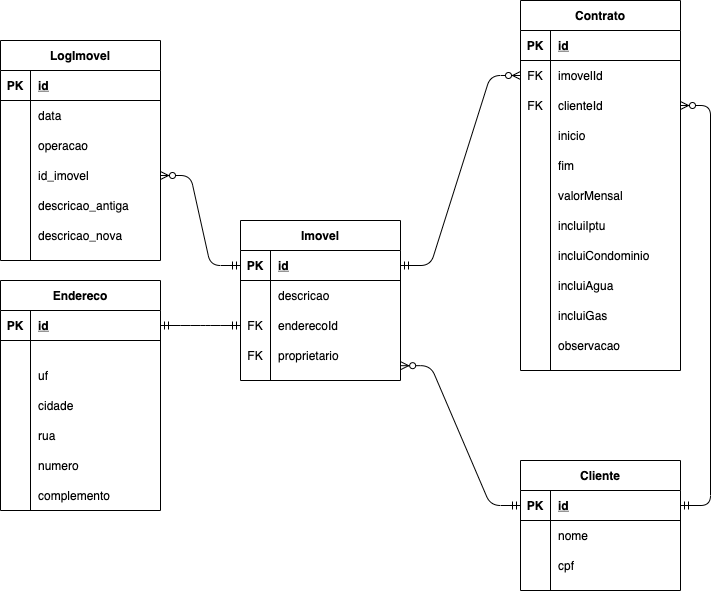

# imobiliaria-api

## Sobre o projeto

O objetivo deste projeto é produzir um protótipo minimamente funcional a fim
de explorar as características de um sistema para gestão imobiliária. O foco principal
do protótipo é fornecer um sistema que permita cadastro, leitura, alteração e remoção
(CRUD) de alguns dados que relacionam entre si.
> Existe uma aplicação cliente feita por mim para consumir esta API, acesse o repositório clicando [aqui](https://github.com/ghabrielmielli/imobiliaria-cliente)

## Feito Com

✤ Banco de dados
- Postgres v5.5

✤ Servidor
- Node-js v12.19.0
- npm v8.1.2
- Dependências
- cors | Necessário para aceitar requisições de clientes externos
- dotenv | Para adicionar variáveis de ambiente (para o bd)
- express | Framework para criar servidores em node
- pg | Módulo para trabalhar com o Postgres
- pg-hstore | Dependência para o Sequelize com Postgres
- sequelize | ORM utilizada no projeto

## Rodando o projeto

Após clonar o repositório, instale os pacotes necessários para rodar a aplicação executando o seguinte comando na pasta raiz do projeto:
```bash
npm install
```

### Configurando o BD
- Primeiro, crie um banco de dados pelo `pgadmin`
- Depois, na pasta raiz do projeto, crie um arquivo e nomeie-o como ‘.env’
- Abra o arquivo ‘.envExemplo’ e copie tudo que está lá para o novo arquivo criado
- Altere as informações para as que você utiliza no pgadmin, e salve o arquivo.
  
### Executando a API
Com o terminal aberto na pasta raiz do projeto, execute o comando:
```bash
node index.js
```
**Pronto!** Agora o servidor está escutando requisições e o esquema do seu
banco já deve estar criado.


## O Esquema Relacional


O esquema relacional foi projetado pensando em ‘Imovel’ como tabela
protagonista. Abaixo, temos uma lista citando as tabelas, assim como uma descrição do
que cada uma representa. Também estão explicados o significado de alguns atributos
que talvez não se autodescrevam. Após isso, serão descritas as relações da tabela.

### Legenda

- **Cliente**: Representa as pessoas, ora locatários, ora locadores, ora ambos.

- **Imovel**: Representa as propriedades disponíveis para aluguel.
  - descricao: Aqui é esperado uma descrição sobre características relevantes para o aluguel desta propriedade, a exemplo: “sobrado com 3 quartos e 2 banheiros; Uma vaga na garagem; Varanda com 13m2; ...”.

- **Endereco**: Representa o logradouro de um imóvel.

- **Contrato**: Representa contratos de aluguel de imóveis.
  - observacao: Por questões de simplicidade, foram reduzidas especificações a respeito das condições do imóvel, presença de mobílias, estado de pintura, conservação, etc a um campo de observação.
  - clienteId: ID do locatário.

- **LogImovel**: Tabela que armazena um histórico de alterações na descrição de imóveis, assim como deleções.


### Relações

❖ Imovel 1..1 - 1..1 Endereco
- Relação obrigatória 1 para 1.

❖ Imovel 1..1 - 0..N LogImovel
- Um imóvel pode ter 0 ou mais logs, e cada log está associado obrigatoriamente a 1 imóvel.

❖ Imovel 0..N - 1..1 Cliente
- Um imóvel está obrigatoriamente associado a um cliente proprietário. Um cliente pode ter zero ou mais imóveis.

❖ Imovel 1..1 - 0..N Contrato 0..N - 1..1 Cliente
- Um imóvel pode fazer parte de 0 ou mais contratos
- Um cliente (locatário) pode fazer parte de 0 ou mais contratos
- Um contrato está associado obrigatoriamente a um imóvel e a um cliente
- A tabela ‘Contrato’ representa uma relação N para N entre imóveis e clientes.
- Observação: A partir desta relação, também podemos obter uma relação N para N entre dois clientes, sendo:
  1. Obtido através do imóvel - locador; e
  2. Já presente na tabela - locatário.
  
